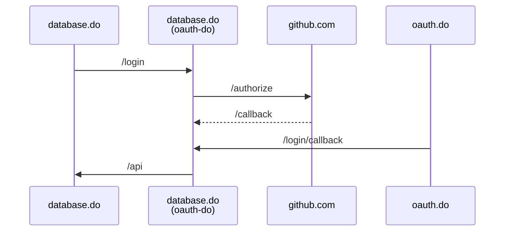

# [oauth.do](https://oauth.do)
Template for Cloudflare Worker with GitHub OAuth


Visit <https://oauth.do/login> to login

## Login Flow Sequence:
- Because other domains have a `*/login*` route to the oauth-do worker
- `https://database.do/login` hit's the `/login` route in oauth-do, and is redirected to the oauth provider: 
- `https://github.com/login/oauth/authorize?`
- Once authorized, GitHub redirects the user back to:
- `https://oauth.do/callback` which hits the `/callback` route in oauth-do, and is redirected back to the original domain:
- `https://database.do/login/callback` which hits the `/login/callback` route in oauth-do, which then generates the JWT token, and redirects the user back to:
- `https://database.do/api` which hits the `/api` route in database-do, except now, there is a cookie in the request header, which is then passed to the CTX service bindings on ctx-do, where the JWT token is verified and dycrypted, and the user object is returned:
```json
{
  "user": {
    "name": "John Doe",
    "email": "john@example.com",
    "image": "https://avatars.github.com/12345.png",
    "claims": "database:edit"
}
```



## [🚀 We're hiring!](https://careers.do/apply)
[Driv.ly](https://driv.ly) is simple APIs to buy & sell cars online, funded by some of the [biggest names](https://twitter.com/TurnerNovak) in [automotive](https://fontinalis.com/team/#bill-ford) and [finance & insurance](https://www.detroit.vc)

We're building our entire infrastructure on Cloudflare Workers, Durable Objects, KV, R2, and PubSub.  If you're as passionate about these transformational technologies as we are, we'd love for you to join our rapidly-growing team.
